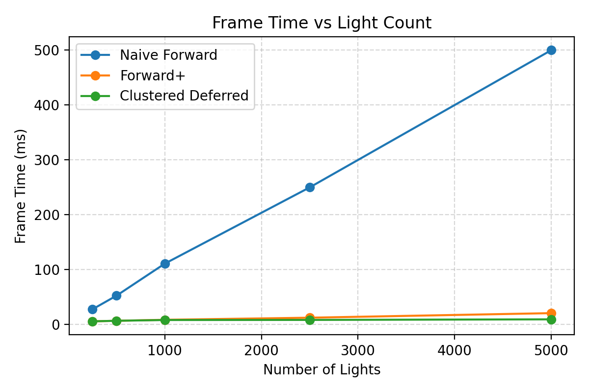
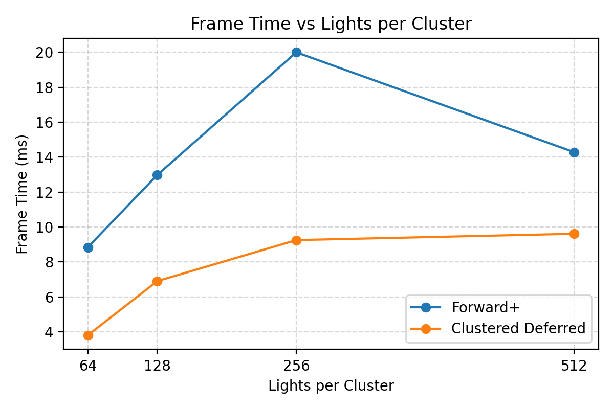

WebGL Forward+ and Clustered Deferred Shading
======================

**University of Pennsylvania, CIS 565: GPU Programming and Architecture, Project 4**

* Ruichi Zhang
* Tested on: **Google Chrome 141.0.7390.123** on
  Windows 10, AMD Ryzen 9 7950X3D @ 4201 Mhz, 16 Core(s), NVIDIA GeForce RTX 4080 SUPER

### Live Demo

### Demo Video/GIF

## Overview

We aim to analyze how different rendering pipelines perform under increasing light counts and varying cluster capacities.  
This helps identify the practical tradeoffs between **per-fragment lighting**, **Forward+ clustering**, and **deferred lighting**.

---

## Pipeline Overview

### Forward+
- Light clustering is performed once per frame in a compute pass.
- Each fragment shades only with the lights affecting its cluster.

### Clustered Deferred
- G-buffer pass stores position, normal, and albedo.
- Lighting pass accumulates contributions from clustered lights.

---

## Implementation

- Light clustering in view space with uniform `(X, Y, Z)` grid.
- Linear Z-slicing for cluster depth partition.
- Each cluster stores the number of lights and their indices.
- Sphere-cluster intersection determines light assignment.
- Cluster indices are computed in the fragment stage from screen position and view-space depth.
- This minimizes per-fragment light loops and allows thousands of lights to be processed efficiently.

---

## Performance Analysis

### Effect of Light Count

*Figure 1: Frame time (ms) vs number of lights for Naive Forward, Forward+, and Clustered Deferred rendering.*

- Naive Forward grows linearly with light count.
- Forward+ and Clustered Deferred scale sublinearly due to clustering.
- Deferred performs slightly better than Forward+.

---

### Effect of Lights per Cluster

*Figure 2: Frame time (ms) vs lights per cluster for Forward+ and Clustered Deferred rendering.*

Increasing the maximum number of lights per cluster directly impacts both performance and rendering quality.
At lower capacities (e.g., 64 or 128), rendering is fast because fewer light contributions are accumulated per fragment. However, many lights are effectively ignored due to cluster overflow, which leads to incomplete lighting and visual artifacts (e.g., dark areas where lights should contribute).
At higher capacities (e.g., 512), more lights are correctly processed per cluster, resulting in visually correct lighting but also higher shading cost. In our experiments, 512 provides a good balance between performance and image quality.

---

## Feature Analysis

### Light Clustering
- Implemented in a compute shader.
- Complexity grows with `#lights × #clusters`.
- Linear slicing keeps indexing simple.

### Deferred G-buffer
- Increases bandwidth usage but reduces fragment shading cost.
- More stable performance at high light counts.

---

## Conclusion

- Naive Forward is simple but scales poorly with many lights.  
- Forward+ reduces per-fragment cost through clustering.  
- Clustered Deferred provides better scalability at high light counts.  
- The number of lights per cluster significantly affects performance and should be tuned per scene.

---

### Credits

- [Vite](https://vitejs.dev/)
- [loaders.gl](https://loaders.gl/)
- [dat.GUI](https://github.com/dataarts/dat.gui)
- [stats.js](https://github.com/mrdoob/stats.js)
- [wgpu-matrix](https://github.com/greggman/wgpu-matrix)
